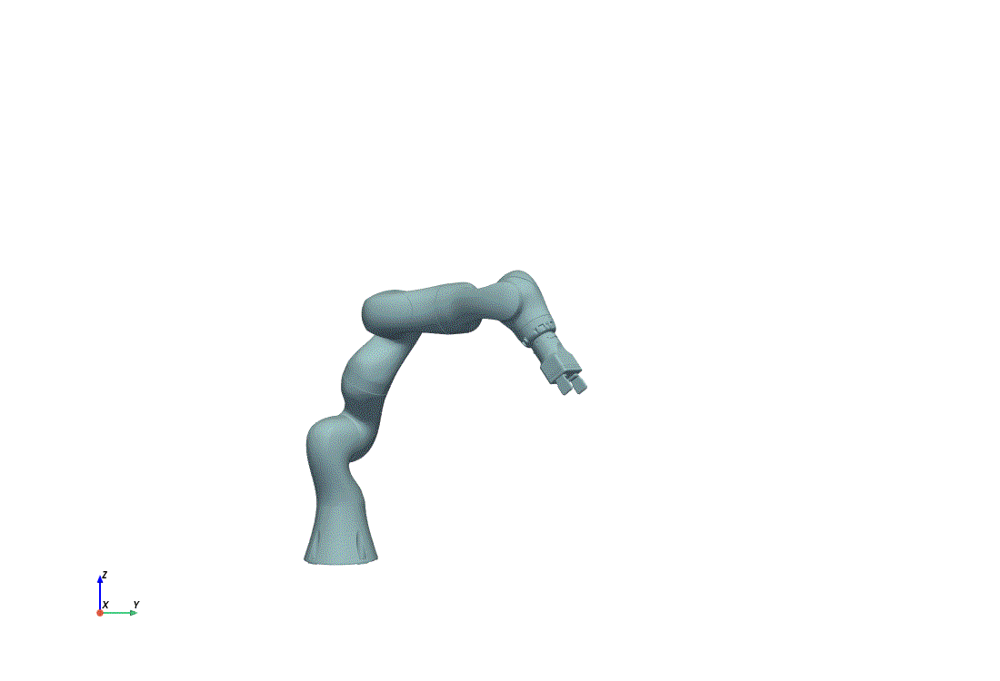
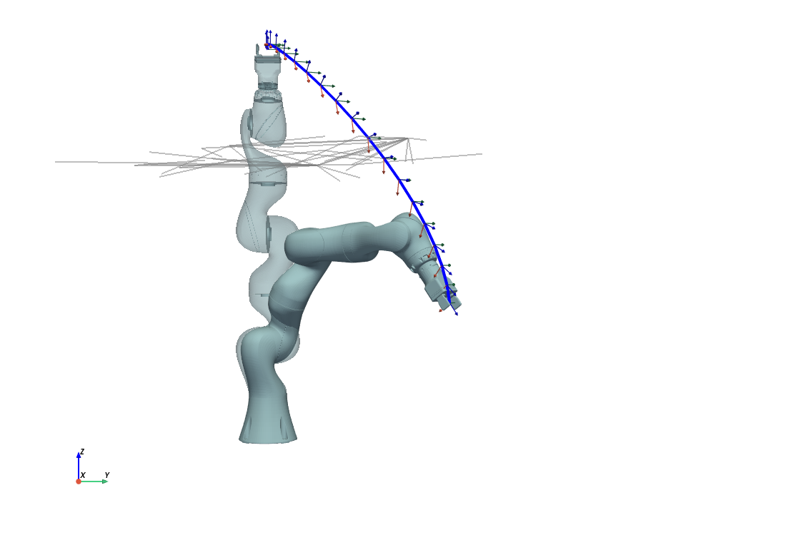
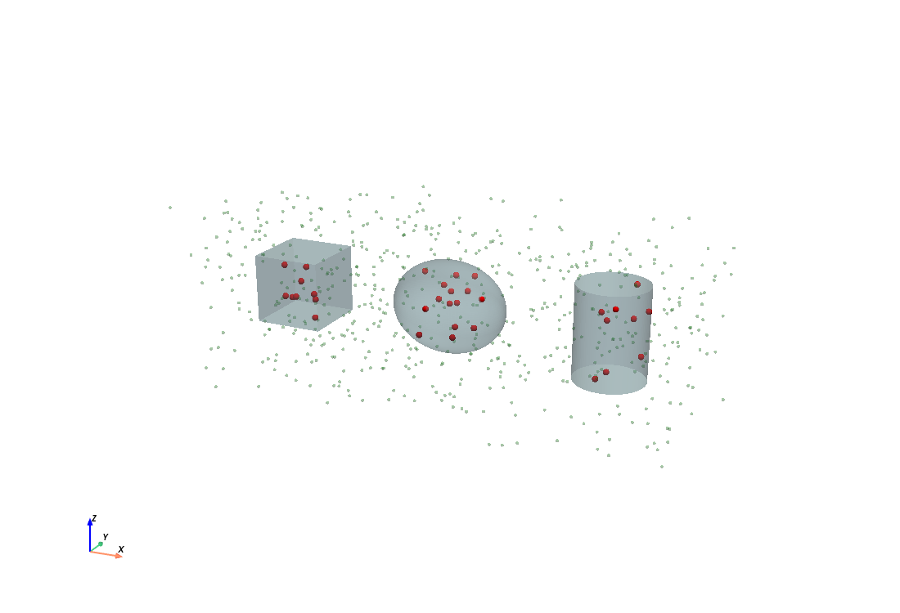
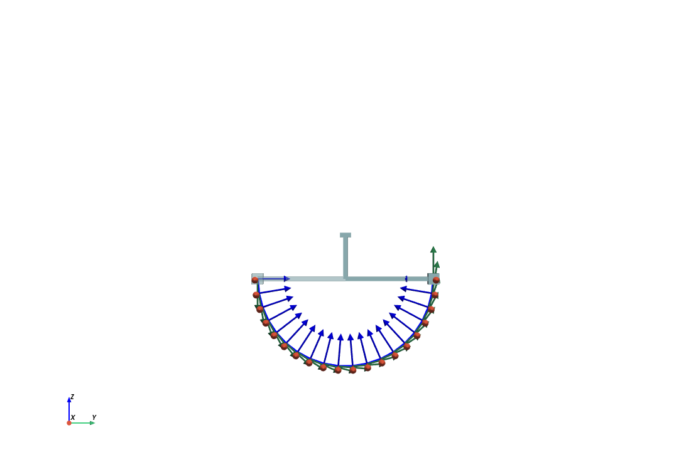

# robot_tools

Modeling, collision checking, 3D visualization, and video tools for robot path planning.

| Package | Purpose |
|---|---|
| `robot_tools` | Kinematics, dynamics (Pinocchio), and point-collision checking |
| `robot_visualization` | Interactive 3D robot visualization with PyVista |
| `robot_video_tools` | Video generation, animation, and camera-calibrated image overlays |
| `urdfpy` | Vendored URDF parser fork (no separate install needed) |

<p align="center">
  
  
</p>
<p align="center">
  <em>Left: animated KUKA iiwa7 following a joint-space path. Right: start/goal configurations
  with the end-effector path, intermediate EE frames, and a motion-planning roadmap (gray).</em>
</p>

## Installation

### Prerequisites

- Python ≥ 3.10

### Install

Clone with submodules — `robot_visualization`, its nested `urdfpy` fork, and
`robot_assets` are git submodules:

```bash
git clone --recursive https://github.com/MaximilianDio/robot_tools.git
# or, in an existing checkout:
git submodule update --init --recursive
```

Then install with:

```bash
pip install ./robot_tools        # from the directory containing the clone
# or equivalently, from inside the repository:
pip install .
```

This installs all four packages listed above together with their dependencies
(Pinocchio, PyVista, OpenCV, ...). There is **no** need to install
`robot_visualization` or `urdfpy` separately.

### Development install

```bash
pip install -e ".[dev]"          # editable + pytest/flake8
```

### Verify

```bash
python -c "import robot_tools, robot_visualization, robot_video_tools, urdfpy; print('ok')"
```

## Quickstart

### Kinematics and dynamics (`robot_tools`)

```python
import numpy as np
from robot_tools import RobotModel

robot = RobotModel("robot_assets/urdf/iiwa7.urdf",
                   p0=np.array([0.0, -1.0, 0.0]),  # base position in world frame
                   R0=np.eye(3))                   # base orientation

q  = np.array([1.0, 0.5, 0.0, -1.0, 0.0, 1.0, 0.0])
dq = np.zeros(7)

T, J = robot.update_kinematics("lbr1_gripper_link_ee", q, dq)   # pose + 6xN Jacobian
M, c, g = robot.update_dynamics(q, dq)                          # mass, Coriolis, gravity
```

### Collision checking (`robot_tools`)

```python
import numpy as np
from robot_tools import create_collision_objects

obstacles = [
    {"type": "ellipsoid", "T": np.eye(4), "xradius": 0.5, "yradius": 0.3, "zradius": 0.4},
    {"type": "cylinder",  "T": np.eye(4), "radius": 0.3, "height": 0.8},
    {"type": "box",       "T": np.eye(4), "xsize": 0.6, "ysize": 0.6, "zsize": 0.6},
]
collision_objects = create_collision_objects(obstacles)

point = np.array([0.1, 0.0, 0.2])
in_collision = any(obj.is_in_collision(point) for obj in collision_objects)
```

<p align="center">
  
</p>
<p align="center"><em>Sampled points tested against box, ellipsoid, and cylinder primitives
(red = in collision).</em></p>

New primitives plug in without touching the factory:

```python
from robot_tools import CollisionObject, register_collision_type

class SphereCollision(CollisionObject):
    def __init__(self, obstacle):
        super().__init__(obstacle)
        self.radius = obstacle["radius"]

    def is_in_collision(self, point):
        return np.linalg.norm(self.to_local(point)) <= self.radius

register_collision_type("sphere", SphereCollision)
```

### 3D visualization (`robot_visualization`)

```python
import numpy as np
import pyvista as pv
from robot_visualization import Robot

plotter = pv.Plotter()
robot = Robot("robot_assets/urdf/iiwa7.urdf", plotter,
              p0=np.array([0.0, -1.0, 0.0]), color="lightblue", opacity=1.0)
robot.set_robot_mesh(id=0)

q0 = np.array([1.0, 0.5, 0.0, -1.0, 0.0, 1.0, 0.0])
q1 = np.zeros(7)
robot.update(q0, id=0)

path = np.linspace(q0, q1, 20)
for q in path:
    robot.plot_ee_frame(q, ee_link_name="lbr1_gripper_link_ee", scale=0.05)
robot.plot_ee_path(path, ee_link_name="lbr1_gripper_link_ee", color="blue")

plotter.show()
```

<p align="center">
  
</p>
<p align="center"><em>The bundled 3-DOF <code>simple_robot.urdf</code> sweeping its
end-effector between two configurations.</em></p>

### Video tools (`robot_video_tools`)

```python
from robot_video_tools import generate_video_from_images, gif_to_mp4

generate_video_from_images("out/camera_images", "out/video.mp4")
gif_to_mp4("docs/images/iiwa7_motion.gif", "out/motion.mp4", desired_duration=5.0)
```

`pip install` also provides a CLI: `robot-gen-video <image_folder> <output.mp4>`.

For compositing PyVista scenes onto real, calibrated camera footage see
`robot_video_tools.ImageOverlay` (hand-eye calibration files required):

```python
from robot_video_tools import CalibrationPaths, ImageOverlay

overlay = ImageOverlay("path/to/images", CalibrationPaths.from_directory("calib/"))
robot = Robot("robot_assets/urdf/iiwa7.urdf", plotter=overlay.plotter)
frame, k, t_frame = overlay.render(t=1.25)   # composited BGR frame
```

## Examples

All scripts run from any working directory:

```bash
python tests/test_collisions.py            # collision primitives
python tests/test_robot_model.py           # kinematics + visualization
python tests/test_robot_visualization.py   # iiwa7 + roadmap graph
python examples/generate_readme_images.py  # regenerates docs/images (off-screen)
```

## Repository structure

```
robot_tools/
├── robot_tools/              # kinematics, dynamics, collision checking
├── robot_video_tools/        # video generation, animation, image overlays
├── robot_visualization/      # git submodule
│   ├── robot_visualization/  #   the actual visualization package
│   └── urdfpy/               #   nested submodule: vendored urdfpy fork
├── robot_assets/             # git submodule: URDF files and meshes
├── tests/                    # runnable example scripts
├── examples/                 # README image generation
├── docs/images/              # generated images used in this README
└── pyproject.toml            # single install for all four packages
```

## Robot assets (URDFs and meshes) - Not part of this package

Define your own robots as URDF files in `robot_assets/urdf/` and load them with `RobotModel` and `Robot`. 

## API reference

See [API.md](API.md) for the full reference of all public classes and functions.

## Troubleshooting

**`pip install` produces `UNKNOWN-0.0.0`** — your pip/setuptools is too old to read
`pyproject.toml` metadata. Upgrade: `python3 -m pip install --upgrade pip "setuptools<80"`.

**`ImportError: ... pinocchio ... undefined symbol`** — another Pinocchio build
(e.g. robotpkg in `/opt/openrobots`) shadows the pip-installed one via
`LD_LIBRARY_PATH`. Run with `env -u LD_LIBRARY_PATH python ...` or remove
`/opt/openrobots/lib` from `LD_LIBRARY_PATH` for sessions using this package.

**Matplotlib/NumPy import errors** — Pinocchio ≥ 4 requires NumPy ≥ 2; modules
compiled against NumPy 1.x (e.g. apt-installed matplotlib/scipy) fail to import.
The pip install already pulls compatible versions into your user site; make sure no
old system versions take precedence (`python3 -m pip list -v`).

**No display / headless rendering** — pass `off_screen=True` to `pv.Plotter` and use
`plotter.screenshot(...)`; see `examples/generate_readme_images.py`.

**`ModuleNotFoundError: urdfpy` or missing meshes** — submodules not initialized:
`git submodule update --init --recursive`, then reinstall.

## Citation

```bibtex
@software{robot_tools,
  author  = {Maximilian Dio},
  title   = {robot_tools: Modeling and Visualization Tools for Robot Path Planning},
  year    = {2026},
  version = {0.2.0}
}
```

## License

MIT — see the package metadata. Built on
[Pinocchio](https://github.com/stack-of-tasks/pinocchio),
[PyVista](https://pyvista.org/), and a fork of
[urdfpy](https://github.com/mmatl/urdfpy).

## Contact

Maximilian Dio — maximilian.dio@fau.de
